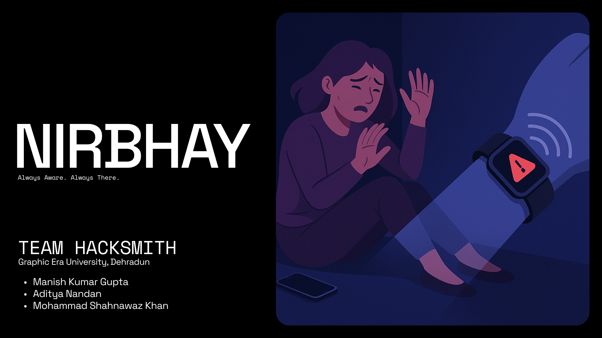

# Nirbhay - Always Aware, Always There

## Pitch Deck

**[Link to pitch deck](https://www.figma.com/deck/OQExg7NDuFGN1PTDLglY4k/Nirbhay?node-id=1-631&t=GxgE3FQwqfiggT5V-1)**

## The Problem We're Solving

In moments of danger, the ability to call for help can be hindered by fear, shock, or physical restraint. Victims of violence, elderly individuals experiencing medical emergencies, and people with disabilities often cannot access their phones to call for help when they need it most.

**Nirbhay** (meaning "Fearless" in Hindi) addresses this critical gap by automatically detecting signs of distress, ensuring that help is dispatched even when the victim cannot act.

## Our Solution

Nirbhay is an integrated safety solution built with accessibility and autonomy at its core. By combining wearable technology with a mobile application, we provide:

### For Vulnerable Individuals

- **Automatic Distress Detection**: No action needed during emergencies - the system detects physical distress automatically
- **Accessibility for All**: Designed for use by people with mobility limitations, elderly, and those at risk
- **Peace of Mind**: Continuous monitoring that respects privacy while ensuring safety
- **Dignity Through Independence**: Allows vulnerable populations to live more independently

### For Caregivers & Loved Ones

- **Real-Time Alerts**: Immediate notification when someone you care for needs help
- **Location Sharing**: Know exactly where help is needed
- **Health Monitoring**: Track vital signs and well-being remotely
- **Reduced Anxiety**: Peace of mind knowing their loved ones have an automatic safety net

## Key Features

- **Distress Pattern Recognition**: Identifies physiological signs of distress without requiring user action
- **Automatic Emergency Response**: Summons help without requiring the wearer to make a call
- **Fall & Assault Detection**: Recognizes sudden impacts and unusual movements associated with falls or attacks
- **Health Monitoring**: Tracks vital signs to detect medical emergencies
- **Accessible Design**: Simple interface designed for all ages and abilities

## Impact & Social Good

### Transforming Lives

- **Women's Safety**: Providing an additional layer of protection for women in vulnerable situations
- **Elder Care Revolution**: Enabling seniors to live independently while remaining connected to help
- **Accessibility**: Making safety accessible to people with disabilities who cannot call for help
- **Mental Health Support**: Reducing anxiety for both users and their families

### Real-World Applications

- **Domestic Violence Prevention**: Automatic detection of physical altercations can save lives
- **Elder Care**: Detects falls and medical emergencies for seniors living alone
- **Personal Safety**: Protection for anyone walking alone in unfamiliar or dangerous areas
- **Disability Support**: Enables those with mobility or communication challenges to summon help

## How It Works

Our system is elegantly simple yet powerful:

1. **Wearable Comfort**: A discreet, comfortable wearable device monitors vital signs and movement
2. **Smart Detection**: Advanced algorithms identify patterns associated with distress
3. **Automated Response**: When distress is detected, the system automatically alerts emergency contacts
4. **Location Sharing**: Precise location data is shared with responders
5. **Health Information**: Vital health information is provided to emergency services

## Future Vision

We envision a world where:

- **Universal Access**: Everyone has access to automatic safety technology regardless of ability
- **Integrated Systems**: Nirbhay connects to smart homes, medical response systems, and community safety networks
- **Preventative Safety**: Machine learning models improve to predict and prevent dangerous situations
- **Global Reach**: Making this technology affordable and accessible in developing regions

## Join Our Mission

We believe that safety should never be limited by ability. Nirbhay represents more than just technology—it's a commitment to creating a world where everyone has access to help when they need it most.

### Support & Collaboration

We are seeking:

- **Community Partners**: Organizations working with vulnerable populations
- **Healthcare Integration**: Partnerships with healthcare providers and elder care facilities
- **Safety Networks**: Collaboration with law enforcement and emergency response services
- **Feedback & Testing**: Real-world users to help us refine and improve our solution

**Nirbhay** - Because Everyone Deserves Safety, Regardless of Ability
